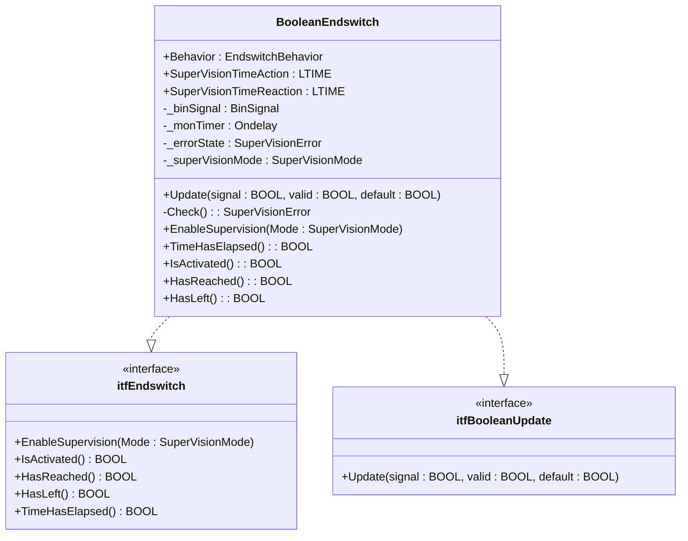
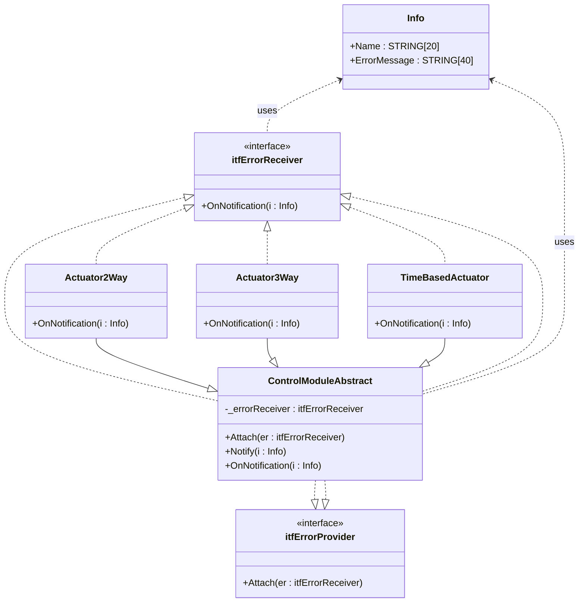

# SupervisedBooleanSignal

## Description

The class `BooleanEndswitch` represents a supervised digital endswitch for automation systems. It encapsulates the logic for monitoring the state of a digital sensor (such as a limit switch) and provides supervision features for different operational modes.

### Purpose and Usage

- **Purpose:**
  - The `BooleanEndswitch` class is used to monitor and supervise the state of a digital input signal, typically representing a physical endswitch or sensor in an automation environment.
  - It supports supervision modes such as position control, action monitoring, and reaction monitoring, allowing detection of errors like missing activation, delayed response, or unexpected state changes.

- **Typical Use Cases:**
  - Detecting whether a mechanical actuator has reached its end position.
  - Supervising the timely response of a sensor after a command is given.
  - Monitoring for stuck or faulty sensors by checking for unexpected or missing state transitions.

- **Features:**
  - Implements the interfaces `itfEndswitch` and `itfBooleanUpdate` for standardized access and update mechanisms.
  - Provides methods to enable supervision, check activation, and query error states.
  - Supports configuration of supervision times for action and reaction monitoring.

---

---

## Messaging Mechanism Class Diagram

The following diagram shows die Vererbung und Beziehungen des Messaging-Mechanismus (Notify/OnNotification):

