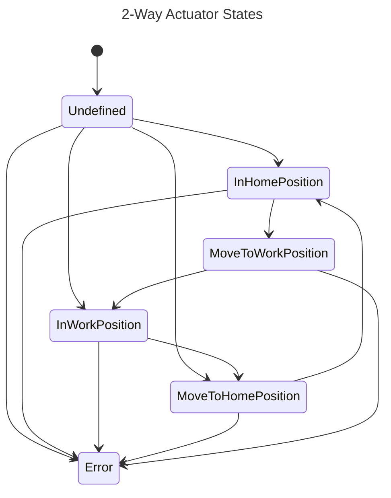
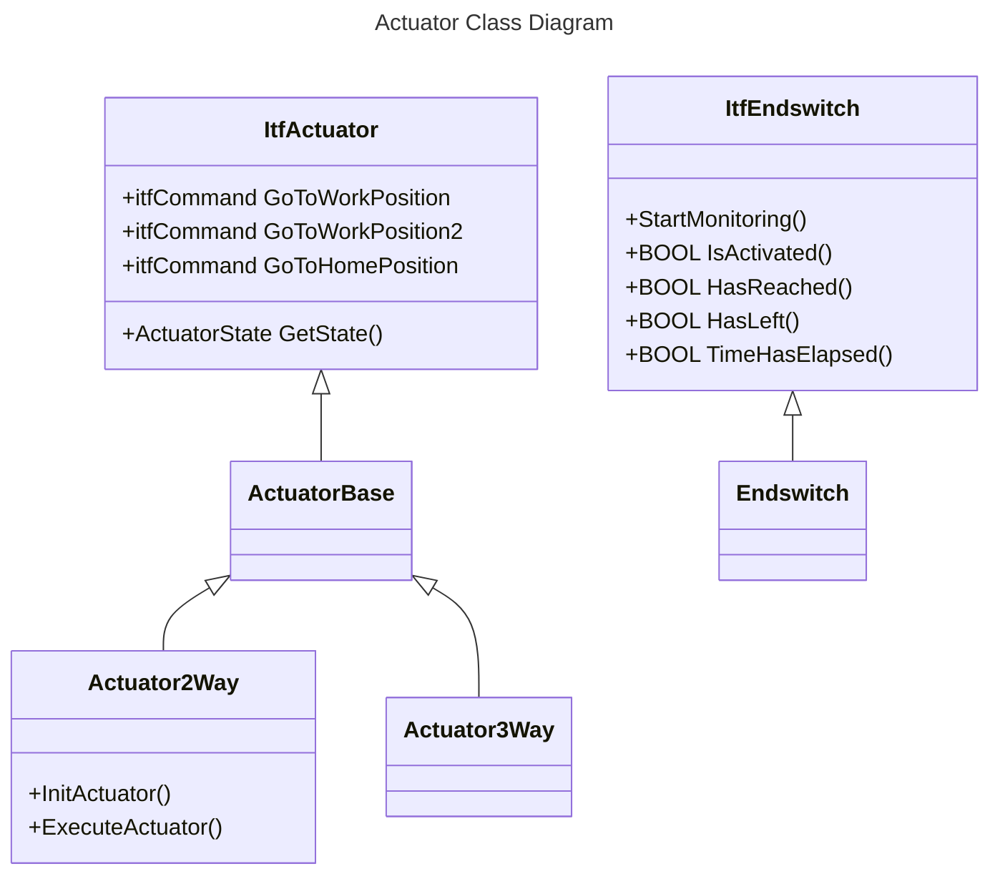
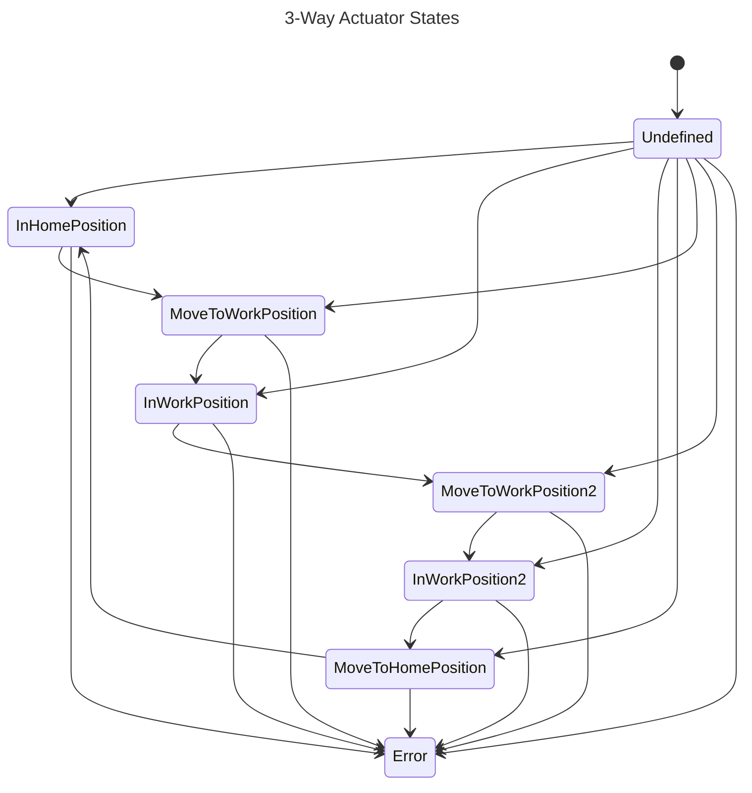

# Actuators

## Overview

This project provides a framework for controlling actuators in a high-bay warehouse system. It includes implementations for 2-way and 3-way actuators, as well as interfaces for sensors and control modules. The actuators are designed to handle transitions between defined states and provide robust error handling.

---

## 2-Way Actuator

The `Actuator2Way` class represents a 2-way actuator that can move between two positions: Home and Work. It uses sensors to determine its current position and transitions between states based on commands and sensor inputs.

### Features

- Moves between two positions: Home and Work.
- Monitors sensor states to determine position.
- Handles undefined and error states gracefully.

### States of the Actuator



### Class Diagram



### Example Usage

```plaintext
// filepath: d:\AX\Demo-Projekte\highbaywarehouse\actuators\src\ApplicationExample.st
PROGRAM Main
    VAR
        actuator : Simatic.Ax.Actuator.Actuator2Way; // Instance of the 2-way actuator
    END_VAR

    // Initialize the actuator
    actuator.InitActuator();

    // Command the actuator to move to the work position
    actuator.GoToWorkPosition();

    // Monitor the actuator's state
    CASE actuator.GetState() OF
        ActuatorState#InWorkPosition:
            // Actuator has reached the work position
            WriteLog('Actuator is in the work position.');
        ActuatorState#InHomePosition:
            // Actuator is in the home position
            WriteLog('Actuator is in the home position.');
        ActuatorState#Error:
            // Handle error state
            WriteLog('Actuator encountered an error.');
        ELSE
            // Other states
            WriteLog('Actuator is transitioning.');
    END_CASE;
END_PROGRAM
```

This example demonstrates how to initialize the actuator, send a command to move it to the work position, and monitor its state to handle transitions or errors.

---

## 3-Way Actuator

The `Actuator3Way` class extends the functionality of the 2-way actuator by adding a third position. It is ideal for applications requiring an additional intermediate or alternate position.

### Features

- Moves between three positions: Home, Work1, and Work2.
- Monitors sensor states for all three positions.
- Provides seamless transitions and error handling.

### States of the Actuator



### Example Usage

```plaintext
PROGRAM Main
    VAR
        actuator : Simatic.Ax.Actuator.Actuator3Way; // Instance of the 3-way actuator
    END_VAR

    // Initialize the actuator
    actuator.InitActuator();

    // Command the actuator to move to the second work position
    actuator.GoToWorkPosition2();

    // Monitor the actuator's state
    CASE actuator.GetState() OF
        ActuatorState#InWorkPosition2:
            // Actuator has reached the second work position
            WriteLog('Actuator is in the second work position.');
        ActuatorState#InHomePosition:
            // Actuator is in the home position
            WriteLog('Actuator is in the home position.');
        ActuatorState#Error:
            // Handle error state
            WriteLog('Actuator encountered an error.');
        ELSE
            // Other states
            WriteLog('Actuator is transitioning.');
    END_CASE;
END_PROGRAM
```

---

## Installation

1. Clone the repository to your local development environment:

   ```bash
   git clone https://github.com/your-repo/highbaywarehouse-actuators.git
   ```

2. Open the project in your preferred PLC programming environment.
3. Ensure all dependencies (e.g., `Simatic.Ax` libraries) are installed and configured.

---

## Configuration

### Actuator Configuration

- Assign appropriate sensors (`ItfEndswitch`) to `I_InHomePosition`, `I_InWorkPosition`, and `I_InWorkPosition2` (for 3-way actuators).
- Configure the monitoring times (`TMonToWorkPosition`, `TMonToHomePosition`) as needed.

### Simulation Mode

- If no sensors or outputs are connected, the actuators will automatically use dummy implementations for simulation.

---

## Troubleshooting

### Common Issues

1. **Actuator does not move:**
   - Ensure the `InitActuator` method is called before sending commands.
   - Verify that the sensors and outputs are correctly assigned.

2. **Error state encountered:**
   - Check the error code using `GetErrorStatus`.
   - Ensure that the sensors are not in conflicting states (e.g., both Home and Work sensors activated).

3. **Unexpected behavior in transitions:**
   - Verify the monitoring times are sufficient for the actuator's movement.
   - Check the wiring and signal integrity of the sensors.

---

## Contributing

Contributions are welcome! Please follow these steps:

1. Fork the repository.
2. Create a feature branch:

   ```bash
   git checkout -b feature/your-feature
   ```

3. Commit your changes and push to your fork.
4. Open a pull request.

---

## License

This project is licensed under the MIT License. See the `LICENSE` file for details.
